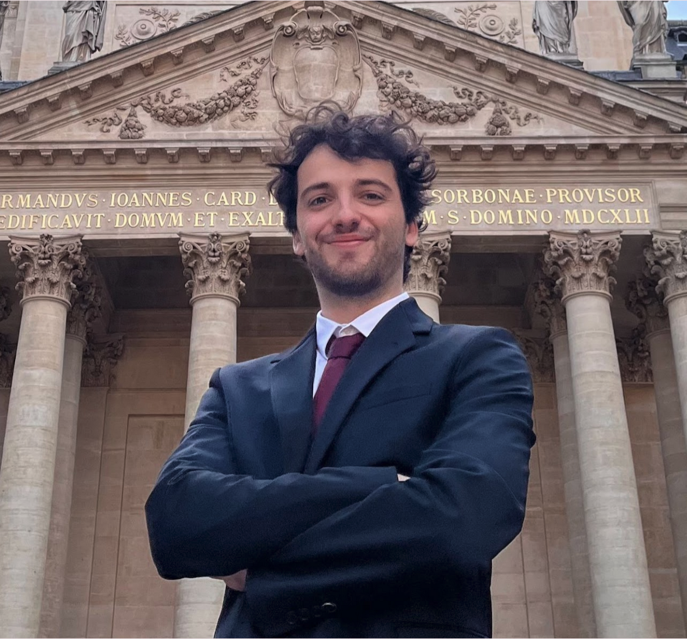

<!-- Main profile block -->

Welcome to my personal website! :)

I am a Ph.D. Candidate at the Paris School of Economics working at the intersection of
Transportation Economics and Behavioral Economics, under the supervision of
<a href="https://www.parisschoolofeconomics.eu/personnes/philippe-gagnepain/">Philippe Gagnepain</a> and
<a href="https://www.parisschoolofeconomics.eu/personnes/carine-staropoli/">Carine Staropoli</a>. I'm also a Research Fellow for
<a href="https://www.parisschoolofeconomics.eu/recherche/initiatives-recherche/chaires-de-recherche/new-deal-urbain/">New Deal Urbain Research Chair</a>
and
<a href="https://www.parisschoolofeconomics.eu/en/research/research-initiatives/research-chairs/sustainable-long-distance-mobility-chair/">Sustainable Long-Distance Mobility Chair</a>.

I am working on solutions to induce changes in transportation habits
towards more sustainable road modal options (currently congestion pricing and carpooling), using experimental designs.

Please, feel free to get in touch! 

<a href="mailto:thibaut.lapeyre@psemail.eu" class="email-text-link">
  ✉
  <em>thibaut.lapeyre[at]psemail.eu</em>
</a>

<!-- Bottom reference / update info -->

Photo credit: background image, <em>Plages Landes</em>.

Last updated: `r format(Sys.Date(), " %B %Y")`

